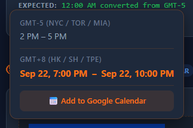
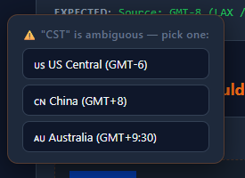
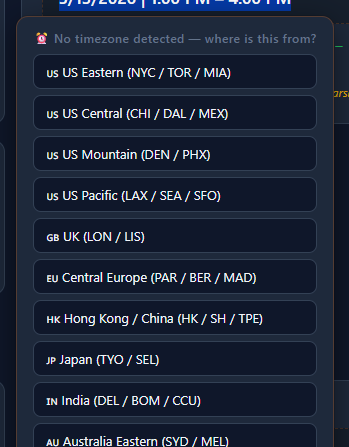
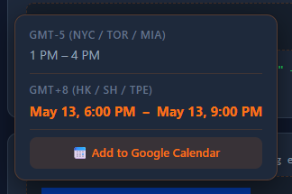
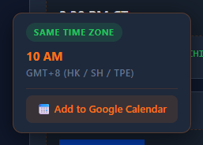

# 🕐 GMT(Get My Time) 時差轉換擴充插件

> **選取時間、右鍵轉換、一鍵加入日曆。就這麼簡單。**
>
> *Select time text, right-click to convert, one-click to calendar. That's it.*

---

跨時區工作最煩的一件事：收到一封信寫著 `3 PM CT`，你得心算那是你的幾點。

或是信箱裡收到Webinar註冊連結，寫著`6/15 9:00-11:00 EST`，還要開工具拉時間來計算自己時區到底是不是死人時間。

更煩的是，很多 Email 裡的時間**根本沒寫時區**——你得自己猜它是哪個時區的。

GMT (GetMyTime) 是一個極輕量的 Chrome / Edge 擴充功能，讓你在任何網頁上圈選時間文字、右鍵一點，瞬間看到對應你本地的時間。專為在美國與亞洲時區之間來回切換的上班族和留學生打造。

*The most annoying part of working across time zones: someone writes `3 PM CT` and you have to do mental math. Even worse, many emails don't include a timezone at all. GMT (GetMyTime) is a lightweight Chrome/Edge extension that lets you highlight any time text on any webpage, right-click, and instantly see it in your local time. Built for professionals and students navigating between US and Asian time zones.*

---

## 🎬 使用方式 · How It Works

### Step 1 — 選取時間文字，右鍵選「🕐 Get My Time」

在任何網頁上選取包含時間的文字，按下右鍵，從選單中點選 **「🕐 Get My Time」**。

*Highlight any time text on any webpage, right-click, and select **"🕐 Get My Time"**.*

### Step 2 — 看到轉換結果

根據偵測到的時區狀況，會有以下幾種情境：

#### 情境 A：有明確時區 → 直接轉換

選取 `3:30 PM CT` → 自動轉換成你的當地時間，附帶 Google Calendar 按鈕。


#### 情境 B：時間範圍 + 日期 → 完整轉換

選取 `Sep 22 from 2 PM to 5 PM CT` → 轉換整個時間範圍，一鍵加日曆。



#### 情境 C：模糊時區 → 跳出選擇器

`CST` 可能是美國中部、中國、或澳洲——讓你選一個。



#### 情境 D：沒有時區標記 → 手動指定來源時區

很多 Email（例如 Kellogg 寄來的 `5/13/2026 | 1:00 PM – 4:00 PM`）不會標時區。擴充功能會跳出選擇器讓你指定來源時區，或確認「這已經是我的時間」。



選擇「US Central」後，立即顯示轉換結果：



#### 情境 E：同時區 → 直接告知

如果來源時區和你的當地時區相同，顯示「Same time zone」。



---

## ✨ 功能特色 · Features

| | 中文 | English |
|---|---|---|
| 🖱️ | **右鍵即轉換** — 選取文字 → 右鍵 → 「🕐 Get My Time」 | **Right-click to convert** — Select text → Right-click → "🕐 Get My Time" |
| 🧠 | **智慧偵測** — 有時區自動轉換；模糊時區跳出選擇器 | **Smart detection** — Explicit TZ auto-converts; ambiguous TZ shows picker |
| ⏰ | **沒時區也能轉** — 沒標時區？手動指定來源時區，或確認是本地時間 | **No-TZ fallback** — No timezone? Pick source TZ or confirm it's local |
| 📊 | **支援時間範圍** — `9 AM – 4 PM`、`10:00 to 14:30` 都沒問題 | **Time ranges** — Handles `9 AM – 4 PM`, `10:00 to 14:30`, etc. |
| 📆 | **看得懂日期** — 能解析 `June 15th at 10 AM CT` 和 `5/13/2026 \| 1 PM` | **Date-aware** — Parses `June 15th at 10 AM CT` and `5/13/2026 \| 1 PM` |
| ⚠️ | **模糊時區處理** — CST、EST、IST 等 8 個容易搞混的縮寫會跳出選擇器讓你挑 | **Ambiguity handling** — 8 ambiguous abbreviations (CST, EST, IST…) trigger a picker |
| 🌍 | **GMT+X 顯示** — 顯示 `GMT-5 (NYC / TOR / MIA)` 而不只是城市名 | **GMT+X display** — Shows `GMT-5 (NYC / TOR / MIA)` for quick context |
| 🌞 | **自動處理日光節約** — 透過 `Intl.DateTimeFormat` 精準處理 DST | **DST auto-handled** — Uses `Intl.DateTimeFormat` for accurate DST |
| 📅 | **一鍵加入 Google 日曆** — Tooltip 內直接附上日曆按鈕 | **Google Calendar** — One-click "📅 Add to Google Calendar" in the tooltip |
| ⚡ | **零框架** — 純 Vanilla JS，超輕量，不依賴任何 library | **Zero frameworks** — Pure Vanilla JS, ultra-lightweight |

---

## 📦 安裝方式 · Installation

> 目前尚未上架 Chrome Web Store，請使用開發者模式載入。
>
> *Not yet published on Chrome Web Store — load via Developer Mode.*

1. Clone 或下載這個 repository / *Clone or download this repo*
2. 在 Chrome 或 Edge 開啟 `chrome://extensions`
3. 右上角啟用 **開發者模式 (Developer Mode)**
4. 點 **「載入未封裝項目」(Load unpacked)** → 選擇專案資料夾
5. 完成 🎉 工具列會出現擴充功能圖示 / *Done! The extension icon appears in your toolbar*

---

## 🧪 測試 · Testing

### 自動化測試 · Automated Tests

使用 [Playwright](https://playwright.dev/) 啟動真實瀏覽器並載入擴充功能進行測試。

*Launches a real browser with the extension loaded via Playwright.*

```bash
npm install
npx playwright install chromium
node test-runner.mjs
```

### 手動測試 · Manual Testing

開啟 `test-cases.html`，裡面有 20 個測試情境。選取虛線框內的文字、右鍵試試看！

*Open `test-cases.html` — it contains 20 test scenarios. Select the dashed-box text and right-click away!*

---

## 📁 專案結構 · Project Structure

```
gmt-getmytime/
├── manifest.json              # Manifest V3 設定 / config
├── background/
│   └── background.js          # Service Worker：右鍵選單 + 訊息路由
├── content/
│   ├── content.js             # 核心邏輯：時間解析、轉換、Tooltip、日曆
│   └── content.css            # Tooltip 樣式
├── popup/
│   ├── popup.html             # 手動轉換器 UI
│   ├── popup.js               # Popup 轉換邏輯
│   └── popup.css              # Popup 樣式
├── icons/                     # 擴充功能圖示 (16 / 48 / 128 px)
├── screenshots/               # README 截圖（自動產生）
├── test-cases.html            # 手動測試頁（20 個場景）
├── test-runner.mjs            # Playwright 自動化測試
└── capture-screenshots.mjs    # 截圖產生腳本
```

---

## 🌐 支援時區 · Supported Time Zones

**明確時區（自動轉換）· Unambiguous (auto-convert):**

`CT` `ET` `PT` `MT` `CDT` `EDT` `PDT` `MDT` `HKT` `JST` `KST` `SGT` `CET` `CEST` `AEST` `AEDT` `NZST` `NZDT` `GMT` `UTC` `GMT±X` `UTC±X`

**模糊時區（跳出選擇器）· Ambiguous (shows picker):**

| 縮寫 | 可能代表的時區 |
|------|--------------|
| `CST` | 🇺🇸 US Central · 🇨🇳 China · 🇦🇺 Australia |
| `EST` | 🇺🇸 US Eastern · 🇦🇺 Australia |
| `IST` | 🇮🇳 India · 🇮🇱 Israel · 🇮🇪 Ireland |
| `PST` | 🇺🇸 US Pacific · 🇵🇭 Philippines |
| `MST` | 🇺🇸 US Mountain · 🇲🇾 Malaysia |
| `BST` | 🇬🇧 British Summer · 🇧🇩 Bangladesh |
| `AST` | 🇨🇦 Atlantic · 🇸🇦 Arabian |
| `SST` | 🇸🇬 Singapore · 🇼🇸 Samoa |

---

## 🛠 技術細節 · Tech Stack

- **Chrome Extension Manifest V3** — 使用最新的擴充功能標準
- **Vanilla JavaScript (ES6+)** — 零依賴，零打包，直接跑
- **Intl.DateTimeFormat** — 瀏覽器原生 API 處理時區與 DST
- **Playwright** — 自動化端對端測試
- **Google Calendar URL API** — 無需 OAuth，透過 URL 參數直接建立事件

---

## 📄 授權 · License

MIT

---

## 👤 作者 · Author

**Henry Yang** — GMT v1.0，使用 Copilot CLI 以 Vibe Coding 

*GMT v1.0, built with Copilot CLI via Vibe Coding.*
